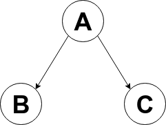
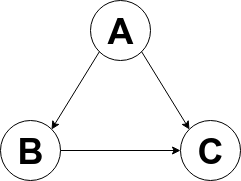

# Como consultar relacionamentos

## O que são relacionamentos

Relacionamentos são ligações entre entitades e atores que possuem uma afinidade conceitual.

Entidades podem ser relacionadas com outras entidades ou atores.

Atores apenas podem se relacionar com entidades.

## Direção
Exitem 2 tipos de relacionamentos: bidirecional e unidirecional

### Bidirecional
Em um relacionamento bidirecional, cada uma das partes possui um relacionamento com a outra parte, ou seja, o relacionamento é reconhecido por seus 2 integrantes.

No exemplo abaixo, a entitdade/ator **A** possui um relacionamento com a entitade/ator **B**. De forma análoga, **B** possui uma relacionamento com **A**:

### Unidirecional
No relacionamento unidirecional, apenas uma das partes conhece o relacionamento, ficando a outra parte alheia.

No exemplo abaixo, a entidade/ator **A** possui um relacionamento com a entidade/ator **B**, porém esta NÃO possui relacionamento com **A**:

## Hierarquia
Um conjunto de entidades/atores relacionados entre si pode ser visto como uma árvore genealógica:

Na imagem acima, **A** é pai de **B** e **C**, **B** e **C** são irmãos.

Porém, como as entidades podem se relacionar livremente, a relação de parentesco pode se tornar complexa, ficando um pouco diferente da forma como conhecemos:

Na imagem acima, temos os mesmos graus de parentescos da imagem anterior, porém com uma peculiaridadade: **B** além de irmão de **C**, também é pai de **C**. Assim como **C** além de irmão de **B**, pode ser visto como filho deste.

A hierarquia pode se tornar mais complexa com relacionamentos bidirecionais:

Na imagem acima, temos **A** sendo pai e filho de **B** ao mesmo tempo, assim como **B** também é pai e filho de **A**.

### Conclusão
O conceito de hierarquia de parentesco (pai, filho e irmão) é utilizado como ponto de partida para se navegar entre os relacionamentos.

Deve-se levar em conta a liberdade que as entidades/atores tem de se relacionar entre si e a direção do relacionamento ao se realizar uma busca, para assim, evitar resultados inesperados.

## Consulta
A partir de uma instância de ator ou entidade, é possível navegar por toda [hierarquia](#hierarquia) de relacionamentos deste objeto e selecionar os relacionamentos que atendem a um certo critério.

Abaixo temos uma visão expandida de todos os métodos que podem ser usados em uma consulta:

entity
  * getParents()
  * getParentActors()
  * getParentEntities()
  * getSiblings()
  * getSiblingActors()
  * getSiblingEntities()
  * getChildren()
  * getChildrenActors()
  * getChildrenEntities()
    * ofType(String...types)
    * relatedOn(Date date)
    * relatedOnOrAfter(Date date)
    * relatedOnOrBefore(Date date)
    * relatedAfter(Date date)
    * relatedBefore(Date date)
    * relatedBetween(Date date1, Date date2)
    * offset(int n)
    * limit(int n)
    * filter()
      * withAttr(String name, String value)
      * withAttrLike(String name, String value)
      * createdOn(Date date)
      * createdOnOrAfter(Date date)
      * createdOnOrBefore(Date date)
      * createdAfter(Date date)
      * createdBefore(Date date)
      * createdBetween(Date date1, Date date2)
      * updatedOn(Date date)
      * updatedOnOrAfter(Date date)
      * updatedOnOrBefore(Date date)
      * updatedAfter(Date date)
      * updatedBefore(Date date)
      * updatedBetween(Date date1, Date date2)
      * not()
      * or()
      * and()
      * openBrackets()
      * closeBrackets()
    * order()
      * byId()
      * byAttr(String name)
      * byCreateDate()
      * byUpdateDate()
      * desc()
  * count()
  * iterator()
  * toList()
  * toMap()
  * groupByType()
  * groupByAttr(String name)
  
